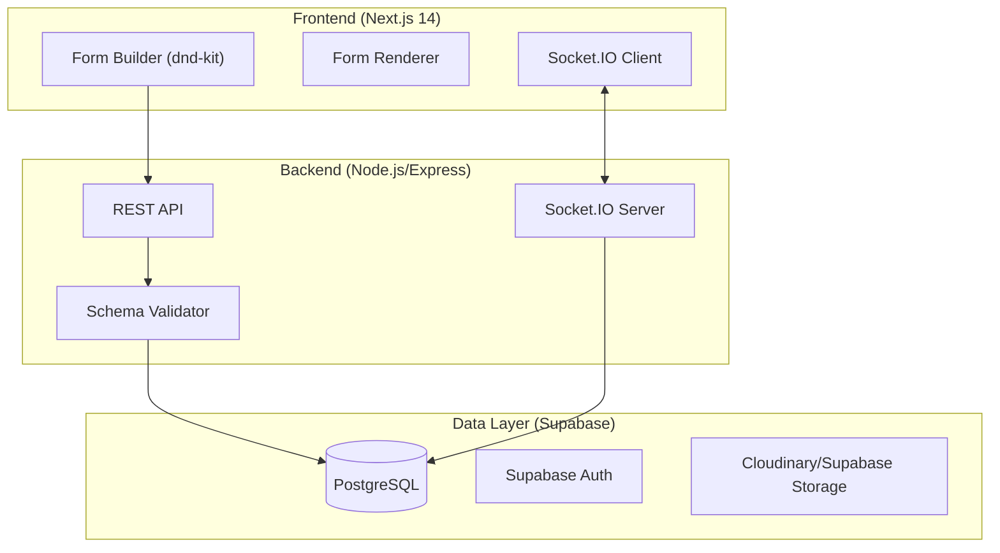

# ☄️ FormFlow — The Ultimate No-Code Form Engine

[](https://nextjs.org/)
[](https://socket.io/)
[](https://supabase.com/)
[](https://tailwindcss.com/)

**FormFlow** is a high-performance, schema-driven SaaS platform for building beautiful, interactive forms. It combines the flexibility of no-code builders with professional-grade validation, real-time collaboration, and deep branding customization.

---

## ✨ Key Features

### 🤝 Real-Time Collaboration
Work together like you're in Figma or Google Docs.
- **Live Presence**: See who else is editing your form in real-time.
- **Remote Cursors**: Track collaborator movements across the canvas.
- **Conflict-Free Sync**: Instant schema synchronization across all sessions.
- **Shared History**: Collaborative undo/redo stack for seamless teamwork.

### 🎨 Themes & Branding
Make every form your own with a powerful design engine.
- **Primary Colors**: Dynamic CSS variable mapping for brand consistency.
- **Custom Logos**: High-resolution upload and display.
- **Typography**: Support for elegant font pairings (Inter, Lexend, etc.).
- **Glassmorphism**: Modern, premium UI aesthetics out of the box.

### 🛡️ Advanced Validation Engine
Professional-grade data integrity with zero code.
- **Regex Support**: Define custom patterns for any field (Phone, SSN, etc.).
- **Length Constraints**: Set strict min/max character limits.
- **Inline Feedback**: Real-time, accessible error messages.
- **Server-Side Guard**: Every submission is re-validated against the schema on the backend.

### 🧩 Multi-Step & Logic
- **Step-by-Step Flow**: Break long forms into manageable phases with progress tracking.
- **Conditional Visibility**: Show or hide fields dynamically based on user answers.
- **One-Question Mode**: A focused, high-conversion layout similar to Typeform.

---

## 🏗️ Technical Architecture

FormFlow is built on a modern **BFF (Backend-for-Frontend)** architecture leveraging WebSockets for state synchronization.



---

## 📄 Schema Definitions

FormFlow uses a unified **JSON Schema** to define the form structure. This allows the same document to drive the builder, the renderer, and the validation logic.

### Form Schema
```typescript
{
  "title": "Customer Feedback",
  "mode": "one-question",
  "theme": {
    "primaryColor": "#6366f1",
    "font": "Lexend"
  },
  "fields": [
    {
      "id": "f_abc123",
      "type": "email",
      "label": "Work Email",
      "step": 1,
      "validation": { "required": true, "message": "Valid work email is required." }
    }
  ]
}
```

---

## 🚀 Getting Started

### 1. Prerequisites
- Node.js 18+
- Supabase Account (for PostgreSQL)

### 2. Installation
```bash
# Clone the repository
git clone https://github.com/Adityarane012/FormFlow.git

# Install dependencies for all workspaces
npm install
```

### 3. Environment Setup
Create a `.env` in `/backend` and `.env.local` in `/frontend`.
- **Backend**: `SUPABASE_URL`, `SUPABASE_SERVICE_KEY`, `PORT=4000`
- **Frontend**: `NEXT_PUBLIC_API_URL=http://localhost:4000`

### 4. Running the App
```bash
# Start Frontend, Backend, and Socket Server concurrently
npm run dev
```

---

## 📊 Dashboard & Exports
- **Real-time Analytics**: Built-in charts (Recharts) for submission trends.
- **Universal Export**: One-click **CSV** and **JSON** exports for external data analysis.

---

## 🛡️ License
Distributed under the MIT License. See `LICENSE` for more information.

---

<p align="center">
  Built with ❤️ for the no-code community.
</p>
